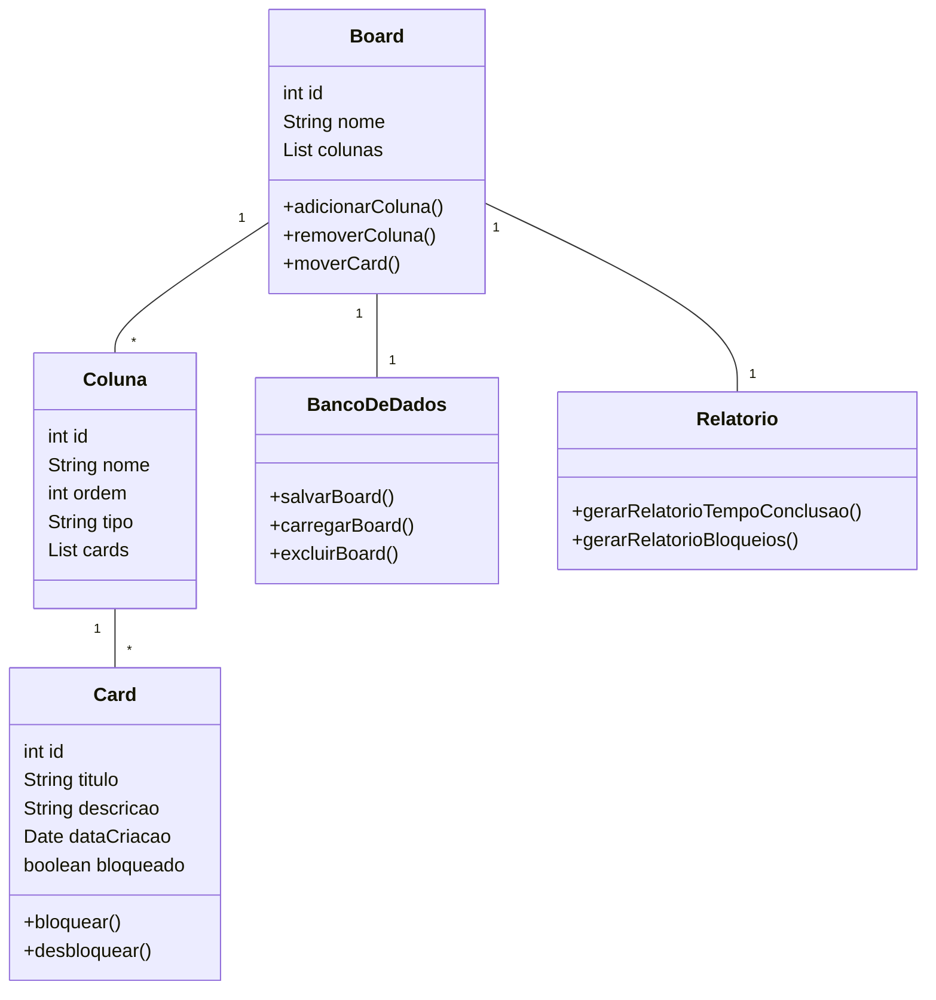

# Criando seu Board de Tarefas com Java

Aprenda a desenvolver um **board de tarefas** em Java, passando por todas as etapas do processo: planejamento, estruturação e implementação de funcionalidades, como **gerenciamento de dados** e **integração entre camadas**, seguindo boas práticas de programação. 😎

## 📌 Sobre o Projeto

O objetivo é criar um **board customizável** para o gerenciamento de tarefas. O sistema permitirá a organização de tarefas em colunas, movimentação de cards e controle de bloqueios.

## 🛠️ Funcionalidades

✅ Criar, selecionar e excluir boards;
✅ Adicionar, mover e cancelar tarefas;
✅ Bloquear e desbloquear cards com justificativa;
✅ Relatórios de tempo e bloqueios dos cards;
✅ Integração com banco de dados MySQL.

## 📋 Requisitos do Sistema

1. O sistema deve iniciar exibindo um menu com as seguintes opções:
   - Criar novo board
   - Selecionar board
   - Excluir boards
   - Sair

2. Os dados do board devem ser armazenados em um banco de dados MySQL.

## 🏗️ Estrutura dos Boards

### 🔹 Características Gerais

- Cada board possui um **nome** e deve ter, no mínimo, **três colunas**:
  1. **Inicial** (onde os cards são colocados inicialmente);
  2. **Final** (tarefas concluídas);
  3. **Cancelamento** (tarefas canceladas).

- O nome das colunas é personalizável pelo usuário.

### 🔹 Tipos de Colunas

Cada coluna do board deve possuir:
- **Nome**
- **Ordem de exibição**
- **Tipo**:
  - **Inicial**: Primeira coluna obrigatória do board.
  - **Final**: Penúltima coluna obrigatória do board.
  - **Cancelamento**: Última coluna obrigatória do board.
  - **Pendente**: Colunas intermediárias, podem ser criadas livremente.

### 🔹 Regras de Navegação dos Cards

- Um **card** contém:
  - **Título**
  - **Descrição**
  - **Data de criação**
  - **Status de bloqueio** (bloqueado ou desbloqueado)

- Um card deve seguir a **ordem das colunas** no board, sem pular etapas, exceto pelo cancelamento, que pode receber cards diretamente de qualquer coluna (exceto a final).
- Cards bloqueados **não podem ser movidos** até serem desbloqueados.
- Para bloquear ou desbloquear um card, é necessário fornecer uma **justificativa**.

## 📌 Menu de Manipulação do Board Selecionado

O sistema deve permitir as seguintes ações dentro de um board:

- Mover card para a próxima coluna
- Cancelar um card
- Criar um novo card
- Bloquear um card (com justificativa)
- Desbloquear um card (com justificativa)
- Fechar board
- 
## 🔹 Requisitos Opcionais

1. Cada card deve armazenar **data e hora**:
   - Quando foi movido para uma coluna;
   - Quando foi transferido para a próxima coluna.

2. O sistema deve gerar um **relatório de produtividade** contendo:
   - Tempo gasto por cada tarefa;
   - Tempo de permanência em cada coluna.

3. O sistema deve gerar um **relatório de bloqueios**, detalhando:
   - Cards bloqueados e seus motivos;
   - Tempo total de bloqueio;
   - Motivo do desbloqueio.


## 🚀 Tecnologias Utilizadas

- **Java** (Linguagem principal)
- **MySQL** (Banco de dados)
- **JDBC/Hibernate** (Para conexão com banco de dados)

## 📌 Como Executar o Projeto

### 📂 Clonar o repositório:
```bash
  git clone https://github.com/seu-usuario/seu-repositorio.git
  cd seu-repositorio
```

### 🔧 Configurar o Banco de Dados:
1. Criar um banco de dados no MySQL.
2. Configurar as credenciais no arquivo de conexão.

### ▶️ Executar o Projeto:
```bash
  javac Main.java
  java Main
```


## 🛠️ Descrição do Diagrama UML




